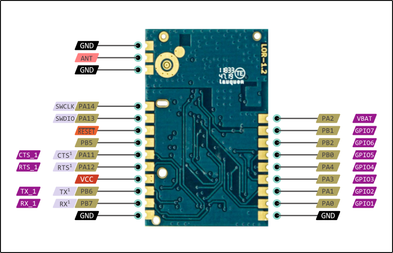
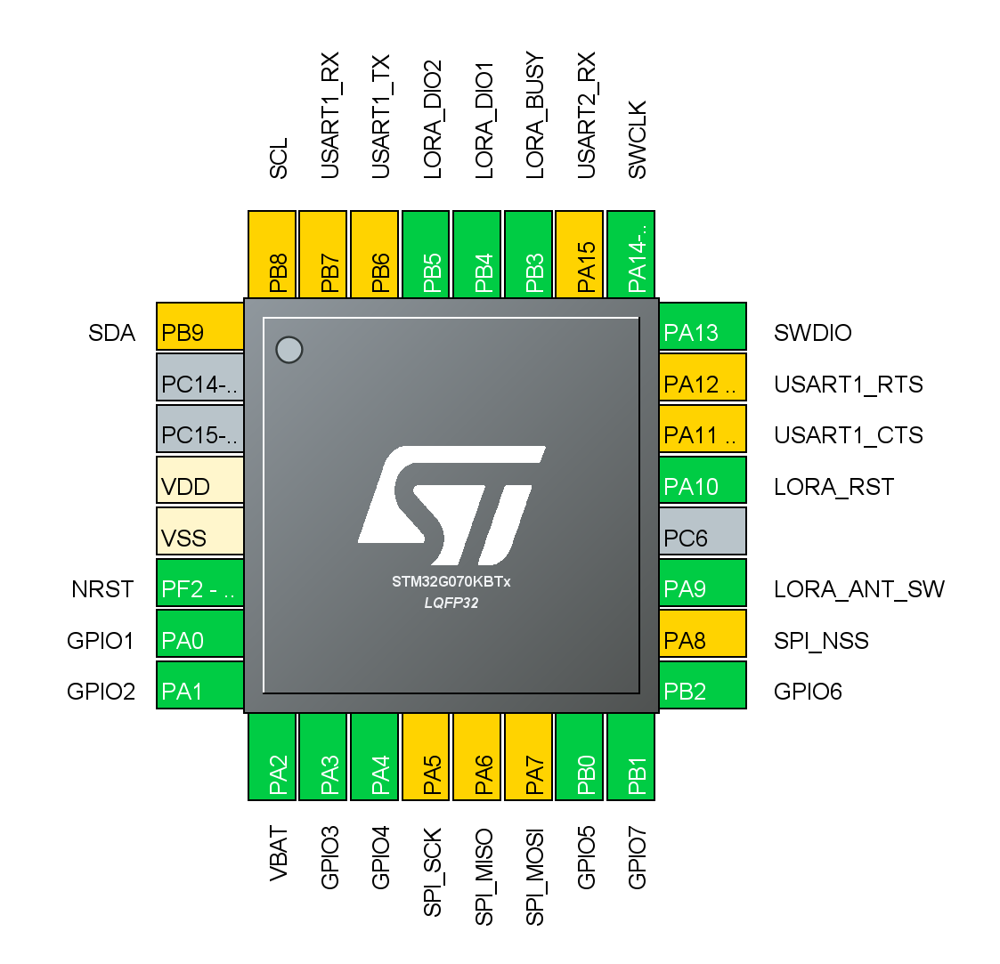

# Quadrar Module

This is a reverse engineering project to make possible to program the Quadrar LoRa Module (LoRaOne) on the Arduino IDE using [Arduino_Core_STM32](https://github.com/stm32duino/Arduino_Core_STM32).

* This board works stable with [Arduino_Core_STM32 v1.8.0](https://github.com/stm32duino/Arduino_Core_STM32/releases).

## Board

The board use the `stm32g070cb` mcu with the `sx1262` lora module, the pins connections is like the image below.

## Pinouts 

This image shows the pins of the mcu.

## Arduino IDE

It's possible to burn and create your firmware using the Arduino IDE using the [Arduino_Core_STM32](https://github.com/stm32duino/Arduino_Core_STM32). It is possible to use the SWD to programing the mcu, you need ST-LINK to do the job.

You need to install the [STM32Cube MCU Packages](https://www.st.com/en/embedded-software/stm32cube-mcu-packages.html) or [STM32CubeProg](https://www.st.com/content/st_com/en/products/development-tools/software-development-tools/stm32-software-development-tools/stm32-programmers/stm32cubeprog.html) to be able to erase the original firmware, the original firmware is not available to re-burn, this process is irreversible.

After installing the STM32CubeProgrammer, connect the ST-LINK. if your ST-LINK is new the STM32CubeProgrammer probably gonna update the ST-LINK firmware.

Next, you need to connect the GND, SWDIO, SWCLK, and VCC of the ST-LINK to the Radioenge module, check the pinout of the module, you need to solder some pins to make easier. 

If you connect everything and tries to connect to the device you should get some error.

You need to hold the reset pin to the GND and press to connect, then pull off the reset.

The connection should be a success.

Now you need to go on the OB (Option Bytes) and find the Read Out Protection (RDP) the value should be BB. Change to AA to remove the protection and press Apply. The board should be erased and is ready to work with the Arduino IDE.

### What board

The [STM32Cube MCU Packages](https://www.st.com/en/embedded-software/stm32cube-mcu-packages.html) does not have the exactly mcu (stm32g070cb), but is possible to use some similar to make works.

You can use the `stm32g071`, the pinout is really similar and should work like a charm.

Select the board `Nucleo-64` and board part number `Nucleo G071RB`. You need to change the upload method to 
`STM32CubeProgrammer (SWD)`.

Now is possible to burn and create some custom firmware. 

### Pinout - IOs

<pre>
#define RX_1	                PB7
#define TX_1	                PB6
#define CTS_1	                PA11
#define RTS_1	                PA12

#define GPIO1	                PA0
#define GPIO2	                PA1
#define GPIO3	                PA3
#define GPIO4	                PA4
#define GPIO5	                PB0
#define GPIO6	                PB2
#define GPIO7	                PB1
#define VBAT	                PA2

#define SWCLK                   PA14
#define SWDIO                   PA13

#define SCL                     PB8
#define SDA                     PB9
</pre>

## EEPROM

This module has a external eeprom the `24AA16` from microchip and is connected on `SCL` and `SDA`.

## LoRa

<b>The LoRa communication is on working progress, this module uses the `sx1262` chip.</b>

### Pinout - Radio LoRa

<pre>
#define RADIO_RESET_PORT        PA10
#define RADIO_MOSI_PORT         PA7
#define RADIO_MISO_PORT         PA6
#define RADIO_SCLK_PORT         PA5
#define RADIO_NSS_PORT          PA8

#define RADIO_BUSY_PORT         PB3
#define RADIO_DIO_1_PORT        PB4
#define RADIO_DIO_2_PORT        PB5

#define RADIO_ANT_SW_PORT       PA9
</pre>

----

See news and other projects about LoRa on my [blog](http://loranow.com).
